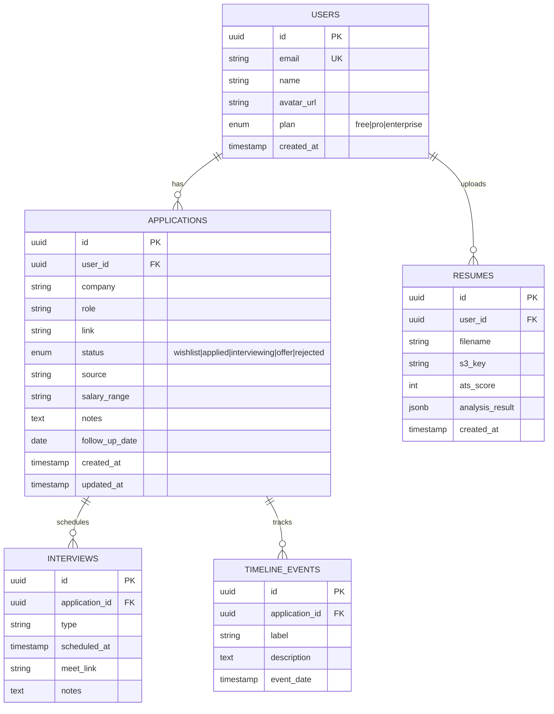
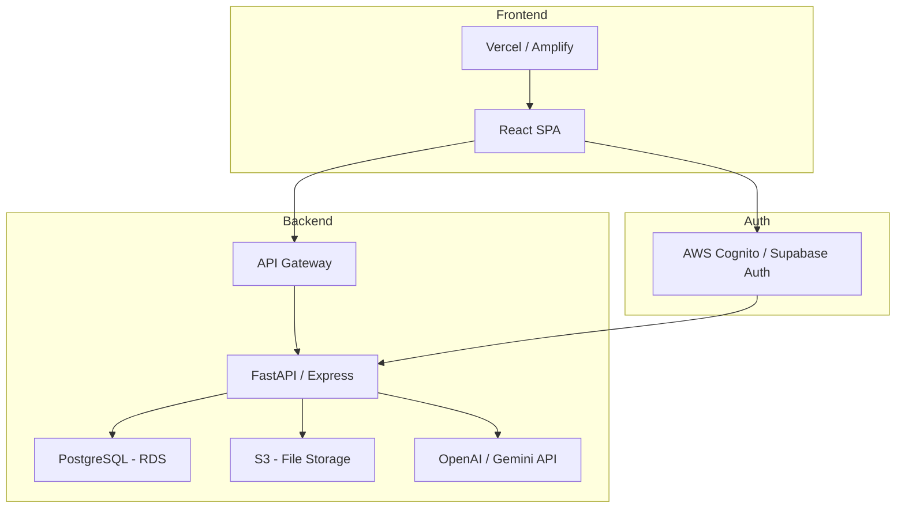

# Applyd — SaaS Readiness Report

**Date:** April 28, 2026
**Project:** Applyd — AI-Powered Job Application Tracker
**Current Stage:** Frontend MVP Complete

---

## Executive Summary

The frontend layer of Applyd is **100% scaffolded** with 9 fully designed pages, a complete routing system, and a design-system-accurate UI. However, the application currently runs entirely on **mock data** with no backend, database, or authentication. To reach a production SaaS, significant backend and infrastructure work remains.

### Overall SaaS Completion

```
████████████░░░░░░░░░░░░░░░░░░ 35%
```

---

## What's Built ✅

### Frontend (100% Complete)

| Layer | Status | Files |
|---|---|---|
| **Design System** | ✅ Tailwind tokens, Inter font, Material Symbols | `tailwind.config.js`, `index.css` |
| **Routing** | ✅ React Router v7, protected route scaffold | `App.jsx` |
| **Layout Shell** | ✅ Sidebar, TopNav, MobileNav, AppShell | `components/` (4 files) |
| **Auth Pages** | ✅ Login + Signup with form validation UI | `Login.jsx`, `Signup.jsx` |
| **Dashboard** | ✅ Stats cards, recent apps, interviews, insights | `Dashboard.jsx` |
| **Applications** | ✅ Filter pills, sortable data table | `Applications.jsx` |
| **Add/Edit** | ✅ Full form, pro-tip card, recent apps grid | `AddEdit.jsx` |
| **Details** | ✅ Company card, notes, timeline, documents | `Details.jsx` |
| **Analytics** | ✅ Gauge, bar chart, donut, insights, platforms | `Analytics.jsx` |
| **Resume Analyzer** | ✅ Upload, ATS score, keyword diff, AI plan | `ResumeAnalyzer.jsx` |
| **Autofill** | ✅ AI URL extraction + manual form | `Autofill.jsx` |
| **API Service Layer** | ✅ Centralized with auth headers | `api.js` |
| **Auth Context** | ✅ Token persistence, login/logout state | `AuthContext.jsx` |

> [!NOTE]
> All pages render with mock/static data. The API service layer (`api.js`) is pre-wired to call `http://localhost:8000/api/v1` — it just needs a backend to connect to.

---

## What's Missing ❌

### 1. Authentication & Authorization (0%)

| Task | Effort | Priority |
|---|---|---|
| AWS Cognito / Auth0 / Supabase Auth setup | 2-3 days | 🔴 Critical |
| JWT token flow (access + refresh) | 1 day | 🔴 Critical |
| Protected route enforcement (currently bypassed) | 0.5 day | 🔴 Critical |
| OAuth providers (Google, GitHub, LinkedIn) | 1-2 days | 🟡 High |
| Email verification + password reset | 1 day | 🟡 High |
| Role-based access (free vs. pro tier) | 1 day | 🟢 Medium |

**Recommended Stack:** AWS Cognito (if staying AWS) or **Supabase Auth** (faster, includes social login out-of-box)

---

### 2. Database & Backend API (0%)

| Task | Effort | Priority |
|---|---|---|
| Database schema design (users, applications, resumes, analytics) | 1-2 days | 🔴 Critical |
| Backend framework setup (Node/Express or Python/FastAPI) | 1 day | 🔴 Critical |
| CRUD API: Applications (create, read, update, delete, list) | 2 days | 🔴 Critical |
| CRUD API: User profile & preferences | 1 day | 🔴 Critical |
| API: Dashboard aggregation endpoint | 1 day | 🟡 High |
| API: Analytics data computation | 1-2 days | 🟡 High |
| API: Resume upload + storage (S3) | 1 day | 🟡 High |
| API: Job URL scraping / extraction | 2-3 days | 🟡 High |
| API: Resume analysis (AI/LLM integration) | 2-3 days | 🟢 Medium |
| Database migrations & seed data | 0.5 day | 🟡 High |

**Recommended Stack:**

| Component | Recommendation | Why |
|---|---|---|
| **Database** | PostgreSQL (via Supabase or RDS) | Relational data, strong for multi-table joins |
| **ORM** | Prisma (Node) or SQLAlchemy (Python) | Type-safe, migration support |
| **Backend** | FastAPI (Python) or Express (Node) | `api.js` already targets `/api/v1` |
| **File Storage** | AWS S3 | Resume PDFs, cover letters |

#### Proposed Schema



---

### 3. AI / ML Features (0%)

| Task | Effort | Priority |
|---|---|---|
| Resume parsing (PDF → structured text) | 1-2 days | 🟡 High |
| ATS keyword matching algorithm | 1 day | 🟡 High |
| LLM integration for resume optimization tips | 1-2 days | 🟢 Medium |
| Job URL scraping + auto-fill extraction | 2-3 days | 🟢 Medium |
| Career insights / recommendation engine | 3-5 days | 🔵 Low |

**Recommended:** OpenAI API or Google Gemini API for LLM features. `PyMuPDF` or `pdfplumber` for resume parsing.

---

### 4. Cloud Infrastructure & DevOps (0%)

| Task | Effort | Priority |
|---|---|---|
| AWS account + IAM setup | 0.5 day | 🔴 Critical |
| Frontend deployment (Vercel, Amplify, or S3+CloudFront) | 0.5 day | 🔴 Critical |
| Backend deployment (ECS Fargate, Lambda, or EC2) | 1-2 days | 🔴 Critical |
| RDS / Supabase database provisioning | 0.5 day | 🔴 Critical |
| S3 bucket for file uploads | 0.5 day | 🟡 High |
| CI/CD pipeline (GitHub Actions) | 1 day | 🟡 High |
| Environment variables / secrets management | 0.5 day | 🟡 High |
| Custom domain + SSL | 0.5 day | 🟡 High |
| Monitoring & logging (CloudWatch / Sentry) | 1 day | 🟢 Medium |
| Rate limiting & API gateway | 1 day | 🟢 Medium |

**Recommended Architecture:**



---

### 5. SaaS Business Layer (0%)

| Task | Effort | Priority |
|---|---|---|
| Stripe integration (subscription billing) | 2-3 days | 🟢 Medium |
| Plan tiers (Free / Pro / Enterprise) | 1 day | 🟢 Medium |
| Usage limits per tier | 1 day | 🟢 Medium |
| Admin dashboard | 3-5 days | 🔵 Low |
| Onboarding flow / tutorial | 1-2 days | 🔵 Low |
| Email notifications (SendGrid / SES) | 1-2 days | 🟢 Medium |
| Landing/marketing page | 2-3 days | 🔵 Low |

---

### 6. Polish & Production Readiness (0%)

| Task | Effort | Priority |
|---|---|---|
| Error boundaries + fallback UI | 0.5 day | 🟡 High |
| Loading skeletons (replace mock data states) | 1 day | 🟡 High |
| Form validation (Zod / Yup) | 1 day | 🟡 High |
| Toast notifications | 0.5 day | 🟡 High |
| Responsive QA (mobile/tablet testing) | 1 day | 🟡 High |
| SEO meta tags per page | 0.5 day | 🟢 Medium |
| Accessibility audit (WCAG 2.1) | 1-2 days | 🟢 Medium |
| Unit tests (Vitest) | 2-3 days | 🟢 Medium |
| E2E tests (Playwright) | 2-3 days | 🔵 Low |
| Performance optimization (lazy loading, code splitting) | 1 day | 🟢 Medium |

---

## Roadmap: Phases to Production

### Phase 1 — Backend Foundation (1-2 weeks)
> Get real data flowing.

- [ ] Set up PostgreSQL + Prisma/SQLAlchemy
- [ ] Build CRUD APIs for Applications
- [ ] Implement Auth (Cognito/Supabase)
- [ ] Wire frontend `api.js` to real endpoints
- [ ] Deploy backend (ECS or Railway)

### Phase 2 — Core Features Live (1-2 weeks)
> Users can actually use the app.

- [ ] Resume upload → S3 storage
- [ ] Dashboard aggregation from real data
- [ ] Analytics computation endpoints
- [ ] Job URL scraping (autofill)
- [ ] Error handling + loading states in frontend

### Phase 3 — AI Integration (1 week)
> The differentiator.

- [ ] Resume parsing (PDF → text)
- [ ] ATS keyword matching
- [ ] LLM-powered optimization tips
- [ ] AI insights for career analytics

### Phase 4 — SaaS Infrastructure (1-2 weeks)
> Start charging.

- [ ] Stripe billing integration
- [ ] Plan tiers + usage gating
- [ ] Email notifications (SES/SendGrid)
- [ ] Custom domain + production deploy
- [ ] CI/CD pipeline

### Phase 5 — Scale & Polish (ongoing)
> Production hardening.

- [ ] Monitoring + alerting
- [ ] Test suites
- [ ] Admin dashboard
- [ ] Marketing site
- [ ] User feedback loop

---

## Effort Summary

| Category | Estimated Effort | Weight |
|---|---|---|
| ✅ Frontend (done) | ~40 hours | 35% |
| ❌ Auth | ~8-10 hours | 8% |
| ❌ Database + Backend API | ~20-25 hours | 20% |
| ❌ AI/ML Features | ~10-15 hours | 10% |
| ❌ DevOps & Infrastructure | ~8-10 hours | 8% |
| ❌ SaaS Business Layer | ~12-15 hours | 10% |
| ❌ Polish & Production | ~12-15 hours | 9% |
| **Total to Production** | **~110-130 hours** | **100%** |

> [!IMPORTANT]
> The frontend represents ~35% of a full SaaS. The remaining 65% is backend, infrastructure, AI, and business logic. Expect **4-6 weeks** of focused full-time work to reach a shippable v1.

---

## Quick-Start Recommendation

If you want the **fastest path to a working SaaS**, use this stack:

| Layer | Tool | Why |
|---|---|---|
| **Auth** | Supabase Auth | Free tier, social login, JWT built-in |
| **Database** | Supabase Postgres | Hosted, auto-APIs, realtime |
| **Backend** | Supabase Edge Functions or FastAPI on Railway | Minimal infra management |
| **File Storage** | Supabase Storage or S3 | Integrated with auth |
| **AI** | Google Gemini API | Cost-effective, multimodal |
| **Payments** | Stripe | Industry standard |
| **Deploy Frontend** | Vercel | Zero-config, preview deploys |
| **CI/CD** | GitHub Actions | Free for public repos |

This stack gets you from **current state → live SaaS in ~3-4 weeks** solo.
